# Volume 29 — Intelligence Modeling Guide (재구축 기준 문서)

**버전:** 2026.07 · Commercial Intelligence `2026.07` · Dashboard build `2026-07-radar-perf-v3`  
**데이터 기준:** 실제 PostgreSQL 고객 DB **2,611,461**명 (샘플 데이터 사용 안 함)  
**목적:** CIOS Intelligence Modeling을 처음 접하는 사람도 이해할 수 있도록, **로직·맵핑·화면**을 한 문서에 정리합니다. 동일 시스템을 다시 개발할 때 이 문서를 기준(checklist)으로 사용합니다.

**관련 문서:** [29 Intelligence Modeling Guide](./29_Intelligence_Modeling_Guide.md) (아키텍처·UI 매핑) · [30 Intelligence Logic & Formulas](./30_Intelligence_Logic_and_Formulas.md) (로직·수식 상세) · [04 Intelligence Engine](./04_Intelligence_Engine.md) · [19 Calculation Framework](./19_Intelligence_Calculation_Framework.md)

---

## 1. Intelligence Modeling이란?

**Intelligence Modeling**은 업로드된 고객 1행(row)마다 아래를 **결정론적(deterministic) 규칙**으로 계산하는 과정입니다.

| 출력 | 의미 |
|------|------|
| PRIZM Proxy Segment | 생활·소비 성향 프록시 세그먼트 |
| Ceragem Segment (5-tier) | High+ ~ Low+ 웰니스·통증 적합도 |
| Purchase Power | 구매력 (High / Medium / Low) |
| Pain Index | 통증·치료 니즈 지수 |
| Lifestyle Index | 웰니스·라이프스타일 지수 |
| Digital Engagement | 온라인·디지털 참여 (Datalogix 기반) |
| Brand Familiarity | 브랜드·한인 커뮤니티 친숙도 (Geo) |
| Recommended Product | Intelligence SKU (V/M/S 시리즈) |
| Promo Outreach Product | Standing promo 적용 **실제 아웃리치 SKU** |
| Expected Conversion / Revenue | Baseline + Promo uplift 분리 예측 |
| Campaign Priority | A–D 우선순위 |

고객 단위 계산 결과는 `CustomerIntelligence` 테이블에 저장되고, 업로드 단위 **Rollup**과 **Mission Control** 대시보드로 집계됩니다.

---

## 2. 전체 아키텍처 (한눈에 보기)

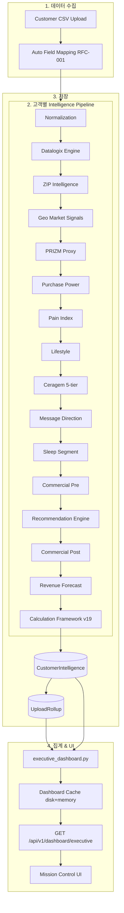

**핵심 원칙**

- **규칙 기반:** ML 블랙박스가 아니라 `backend/app/intelligence/*_rules.py` + Volume 10 Business Rule Library.
- **버전 관리:** `commercial_version`, `rule_version`, `generated_by` (예: `commercial_recalc:2026.07`).
- **설명 가능:** 고객 상세 API에서 factor / rationale 제공 (`/intelligence/framework/{id}`).

---

## 3. 입력 → 출력 맵핑 그래프

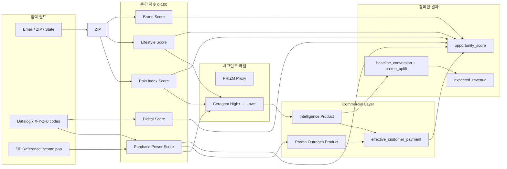

---

## 4. Intelligence Pipeline 실행 순서

구현: `backend/app/intelligence/pipeline.py` → `run_intelligence_pipeline()`

| 순서 | 엔진 | 파일 | 하는 일 (초보자 설명) |
|------|------|------|------------------------|
| 1 | Normalization | `normalization.py` | CSV 컬럼을 내부 표준 필드로 정규화 |
| 2 | Datalogix | `datalogix_engine.py` | Datalogix 코드를 **원본 그대로** 보존·해석 |
| 3 | ZIP | `zip_engine.py` | ZIP 기준 인구·소득·카운티 intelligence |
| 4 | Geo Market | `geo_intelligence.py` | 주·Metro tier, 브랜드 친숙 Geo boost |
| 5 | ZIP Income Proxy | `commercial/engine.py` | 소득 proxy (commercial pre 단계) |
| 6 | PRIZM Proxy | `prizm.py` | PRIZM 유사 lifestyle cluster |
| 7 | Purchase Power | `purchase_power.py` | Net worth / income / home value → High·Med·Low |
| 8 | Pain Index | `pain_index.py` | 통증·치료 니즈 (Geo chronic pain 가중) |
| 9 | Lifestyle | `lifestyle.py` | 웰니스·활동 성향 |
| 10 | Ceragem Segment | `ceragem.py` | 5-tier (High+ … Low+) — **제품 적합 핵심** |
| 11 | Message Direction | `message_direction.py` | Email / DM / Nurture 등 메시지 전략 |
| 12 | Sleep Segment | `sleep_segmentation.py` | 수면 박 deprivation tier |
| 13 | Commercial Pre | `commercial/engine.py` | 카탈로그·standing promo 컨텍스트 주입 |
| 14 | Recommendation | `recommendation.py` | Intelligence SKU 선택 + rationale |
| 15 | Commercial Post | `commercial/engine.py` | Promo outreach SKU, effective price |
| 16 | Forecast | `forecasting.py` | baseline_conversion, promo_uplift, revenue |
| 17 | Framework | `calculation_framework.py` | Volume 19 score·confidence·audit JSON |

업로드 처리 후 `build_upload_rollup()` (`acquisition/rollup.py`)가 state / zip / ceragem / pp_band / ceragem_prod 등 dimension으로 **사전 집계**합니다. Mission Control은 cold path에서 rollup-first로 응답합니다 (~36s cold → 캐시 hit ~0ms).

---

## 5. 핵심 인덱스 — 초보자 설명

| 인덱스 | 질문 | High일 때 의미 | 주요 입력 |
|--------|------|----------------|-----------|
| **Purchase Power** | “살 여력이 있는가?” | 프리미엄 SKU(V9/V7)도 접근 가능 | Datalogix net worth, income, home value, ZIP income |
| **Pain Index** | “통증·치료 니즈가 큰가?” | Master V 시리즈 therapeutic fit ↑ | Geo chronic pain, age, Ceragem inputs |
| **Lifestyle** | “웰니스·활동 성향인가?” | Pause M / wellness narrative fit ↑ | PRIZM proxy, activity codes |
| **Digital Engagement** | “온라인 반응 가능성?” | Email/digital 캠페인 적합 | Datalogix online access |
| **Brand Familiarity** | “브랜드·커뮤니티 친숙도?” | Korean enclave, metro brand affinity | Geo `brand_familiarity_geo`, state enclave % |
| **Ceragem Segment** | “Ceragem 5-tier 중 어디?” | High+ = 최우선 therapeutic wellness | PP + Pain + Lifestyle **복합 규칙** (`ceragem_rules.py`) |
| **PRIZM Proxy** | “생활·소비 cluster?” | 메시지톤·채널 힌트 | Datalogix + ZIP (`prizm_rules.py`) |

**ORION DNA 레이더** (`intelligence_radar`)는 위 카테고리의 **가중 평균**을 축(axis)별 0–100 점수로 표현합니다.

---

## 6. Commercial Intelligence & Standing Promo

### 6.1 Effective Price (고객 실제 지불가)

```python
# backend/app/commercial/engine.py
effective_customer_payment(product_code)
# = catalog gross_sales × (1 - standing default_promotion_pct)  # SAVE20/SAVE30
# standing promo 없으면 gross_sales 그대로
```

Standing promo SKU (2026.07 기준): **Master V6, Master V5, Pause S4, Pause M10, Pause M6s**

### 6.2 Intelligence SKU vs Promo Outreach SKU

| 개념 | 용도 |
|------|------|
| **Intelligence Product** | 규칙 엔진이 추천하는 **치료·웰니스 적합 SKU** (Opportunity ranking, Radar) |
| **Promo Outreach Product** | Standing promo 정책을 반영한 **실제 캠페인 아웃리치 SKU** (`standing_promo_outreach_product`) |

예: Intelligence는 Pause M6s를 추천하지만, promo eligibility에 따라 Pause M6 + SAVE20으로 아웃리치할 수 있습니다.

### 6.3 Baseline vs Promo Uplift

- **baseline_conversion:** standing promo 없을 때 예상 전환율  
- **promo_uplift:** standing promo로 인한 추가 전환율  
- **predicted_conversion** = baseline + uplift (Mission Control KPI)

---

## 7. Opportunity Score (기회 점수) 로직

구현: `backend/app/campaign/opportunity_score.py`

### 7.1 State / Radar Opportunity Score

```
intelligence_blend = 0.22×Pain + 0.20×PP + 0.18×Lifestyle + 0.20×Brand + 0.20×Digital

score = intelligence_blend × 0.55
      + revenue_share × 85 × 0.25
      + conversion × 10000 × 0.15
      + product_fit (max 18)
```

**product_fit** 구성:

- **Series fit:** V-series ↔ Pain, M-series ↔ Lifestyle, S4 ↔ entry wellness  
- **Price accessibility:** `effective_customer_payment(outreach SKU)` vs PP score  
- **Lifestyle tier alignment**

### 7.2 ZIP Opportunity Score (Recent Opportunities 테이블)

ZIP 가중치: PP 24% · Campaign Priority 18% · Revenue share 20% · Conversion 12% · Intelligence blend 26% + series fit

### 7.3 Radar X축 Spread

동일 cohort의 Pain/Lifestyle/PP/Brand/Digital 점수가 비슷하면 radar가 한 점에 몰립니다.  
`apply_radar_axis_spreads()` (`AXIS_SPREAD_FLOOR=18`, `CEILING=92`)로 **시각적 분산**만 조정합니다. **Opportunity Score(Y축)는 변경하지 않습니다.**

---

## 8. Mission Control — 위젯별 데이터 사전

**API:** `GET /api/v1/dashboard/executive`  
**프론트:** `frontend/src/app/(dashboard)/mission-control/page.tsx`  
**스크린샷:** 실제 2.6M DB 기준 (`docs/assets/intelligence-modeling/`)

### 8.1 전체 화면

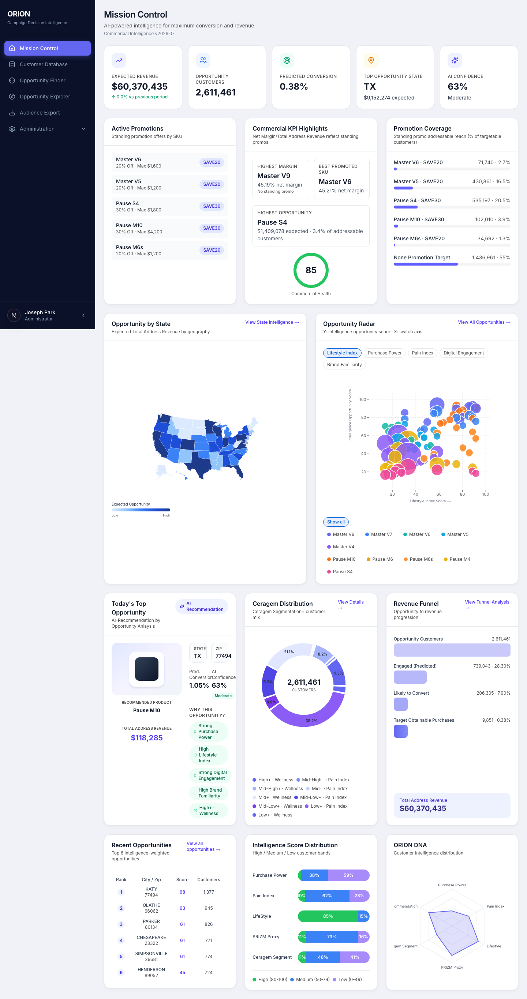

---

### 8.2 Executive KPI Row

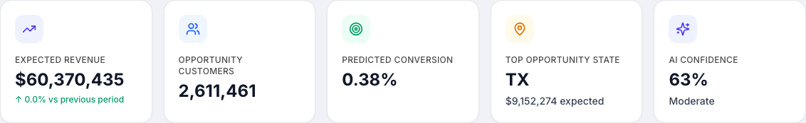

| KPI | API 필드 | 로직 |
|-----|----------|------|
| Expected Revenue | `expected_revenue` | Rollup Σ expected_revenue |
| Opportunity Customers | `targetable_customers` | 이메일 보유 targetable count |
| Predicted Conversion | `predicted_conversion_rate` | baseline + promo_uplift |
| Top Opportunity State | `top_opportunity_state` | max `opportunity_score` by state |
| AI Confidence | `intelligence_radar` avg | Radar 축 score 평균 → Very High/High/… |

---

### 8.3 Commercial Intelligence Panel

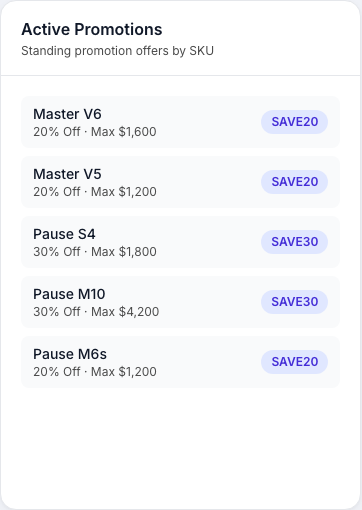

| 위젯 | API 경로 | 로직 |
|------|----------|------|
| Active Promotions | `commercial_intelligence.active_promotions` | `ACTIVE_STANDING_PROMOTIONS` 카탈로그 |
| Commercial KPI Highlights | `highest_margin_sku`, `best_standing_promo_sku`, … | `commercial/summary.py` SKU KPI |
| Promotion Coverage | `promotion_coverage` | PP·Ceragem fit으로 promo eligible 고객 % |
| Commercial Health | `commercial_health_score` | Margin + coverage + promo balance |

---

### 8.4 Opportunity by State

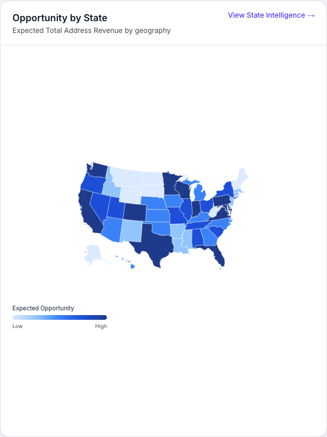

| 항목 | 설명 |
|------|------|
| 데이터 | `state_performance[]` — state, revenue, customers, conversion, opportunity_score, index scores |
| 색상 | Expected revenue choropleth |
| Geo | `us-choropleth-map.tsx` — Albers USA, AK/HI/FL fit padding |
| Drill-down | `/explorer?level=state&state=TX` |

---

### 8.5 Opportunity Radar

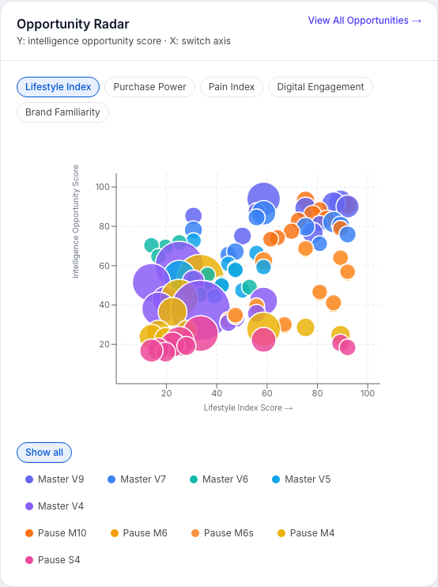

| 항목 | 설명 |
|------|------|
| Y축 | `opportunity_score` (변경 없음) |
| X축 (전환) | Lifestyle / Purchase Power / Pain / Digital / Brand |
| 점 | `radar_opportunities[]` — state 또는 zip cohort |
| 색 | Product series (Master V9, Pause S4, …) |
| X축 spread | `apply_radar_axis_spreads()` — 표시용만 |

---

### 8.6 Today's Top Opportunity

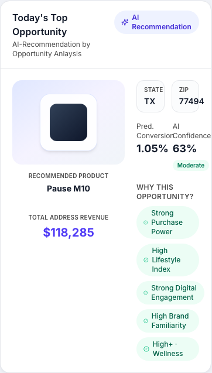

| 항목 | 설명 |
|------|------|
| 선택 | `top_zips[0]` 또는 max opportunity state |
| Product | Intelligence recommended SKU |
| Reasons | PP / Pain / Lifestyle / Digital / Brand ≥ 60 인 factor |
| Revenue | 해당 ZIP/state expected_revenue |

---

### 8.7 Ceragem Distribution

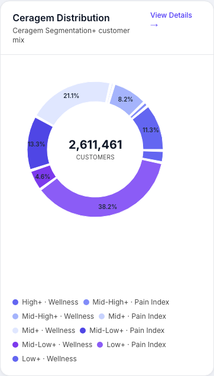

| 항목 | 설명 |
|------|------|
| 데이터 | `ceragem_distribution[]` (rollup `ceragem_prod` dimension) |
| 세그먼트 | High+, Mid-High+, Mid+, Mid-Low+, Low+ |
| 표시 | 고객 수, %, revenue, top products |

---

### 8.8 Revenue Funnel

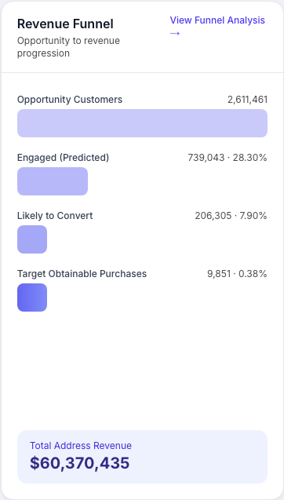

| Stage | 계산 (UI model) |
|-------|-----------------|
| Opportunity Customers | `targetable_customers` |
| Engaged (Predicted) | targetable × 28.3% |
| Likely to Convert | targetable × 7.9% |
| Target Obtainable Purchases | `expected_orders` |

Funnel은 **executive 요약 시각화**이며, stage 비율은 forecast 모델에서 derive됩니다.

---

### 8.9 Recent Opportunities

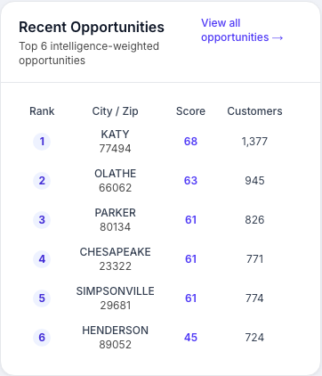

| 컬럼 | API 필드 |
|------|----------|
| Rank | ZIP `opportunity_score` 정렬 top 6 |
| Location | state, city, zip |
| Score | `compute_zip_opportunity_score()` |
| Conversion | baseline + promo 표시 |
| Products | `intelligence_product`, `promo_outreach_product` |

Rollup-first `_top_zips()` — `UploadRollup` zip dimension (~0.15s).

---

### 8.10 Intelligence Score Distribution

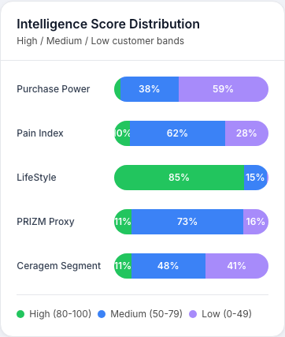

| 항목 | 설명 |
|------|------|
| 데이터 | `intelligence_score_distribution[]` |
| 축 | Purchase Power, Pain, Lifestyle, PRIZM, Ceragem |
| 밴드 | High / Medium / Low customer % |

---

### 8.11 ORION DNA

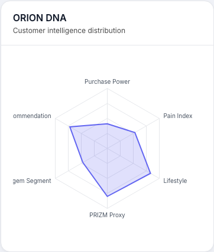

| 항목 | 설명 |
|------|------|
| 데이터 | `intelligence_radar[]` — `{ axis, score }` |
| 용도 | 전체 cohort intelligence “shape” 한눈에 파악 |
| Confidence | KPI row AI Confidence와 동일 계열 |

---

## 9. API · 코드 · DB 빠른 참조

| 영역 | 경로 |
|------|------|
| Pipeline 진입 | `backend/app/intelligence/pipeline.py` |
| Opportunity Score | `backend/app/campaign/opportunity_score.py` |
| Executive Dashboard | `backend/app/campaign/executive_dashboard.py` |
| Rollup Builder | `backend/app/acquisition/rollup.py` |
| Dashboard Cache | `backend/app/cache/dashboard_cache.py` |
| Commercial Engine | `backend/app/commercial/engine.py` |
| Standing Promo Demand | `backend/app/campaign/standing_promo_demand.py` |
| Mission Control UI | `frontend/src/app/(dashboard)/mission-control/page.tsx` |
| Choropleth Map | `frontend/src/components/dashboard/us-choropleth-map.tsx` |
| Radar Spread (FE) | `frontend/src/lib/radar-axis-spread.ts` |
| Executive API | `GET /api/v1/dashboard/executive` |
| Customer Framework | `GET /api/v1/intelligence/framework/{customer_id}` |

**주요 DB 테이블:** `Customer`, `CustomerIntelligence`, `CustomerDatalogix`, `UploadRollup`, `ZipIntelligence`

**Rollup dimensions:** `state`, `zip`, `ceragem`, `pp_band`, `ceragem_prod`, `pp_band_prod`, index levels per state

---

## 10. 재구축 체크리스트

다시 개발할 때 아래 순서로 검증합니다.

1. **업로드·맵핑:** CSV → RFC-001 auto mapping → `Customer` + Datalogix 저장  
2. **Pipeline:** 고객 1명 spot-check — 17단계 trace + `framework_json`  
3. **Commercial recalc:** `commercial_recalc:2026.07` — 2.6M rows, errors 0  
4. **Rollup:** 74+ uploads backfill — zip/state/ceragem_prod dimensions  
5. **Executive API:** cold < 60s, warm cache ~0ms, `EXECUTIVE_DASHBOARD_BUILD_VERSION` 일치  
6. **Mission Control:** KPI · Radar · Map · Recent Opp · Ceragem dist 시각 일치  
7. **Standing promo:** M6 vs M6s outreach differentiation, effective price in opportunity score  
8. **테스트:** `test_executive_dashboard.py`, `test_opportunity_score.py`, `test_standing_promotions.py`

### 스크린샷 재생성

```bash
# Backend :8000, Frontend http://localhost:3002 (localhost 필수 — CORS)
cd backend && .venv/bin/python ../scripts/capture_mission_control_screenshots.py
```

출력: `docs/assets/intelligence-modeling/01-…-11-….png`

---

## 11. 용어 사전 (Glossary)

| 용어 | 설명 |
|------|------|
| **Targetable** | 이메일 등 캠페인 reachable 고객 |
| **Addressable Revenue** | expected_revenue (전체 cohort 합) |
| **Intelligence SKU** | 추천 엔진 pure product |
| **Outreach SKU** | Standing promo 반영 실제 contact product |
| **Rollup-first** | Dashboard가 live 2.6M scan 대신 UploadRollup 사용 |
| **Commercial version** | 가격·promo 카탈로그 버전 (2026.07) |

---

*이 문서는 Mission Control 실데이터 스크린샷과 as-built 코드(2026.07)를 기준으로 작성되었습니다. 규칙 변경 시 Volume 04·10·19와 함께 본 문서를 업데이트하세요.*
