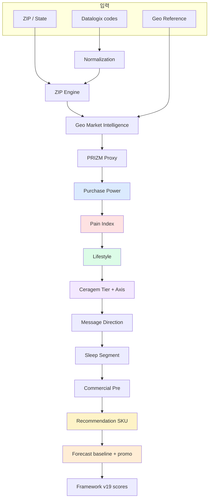
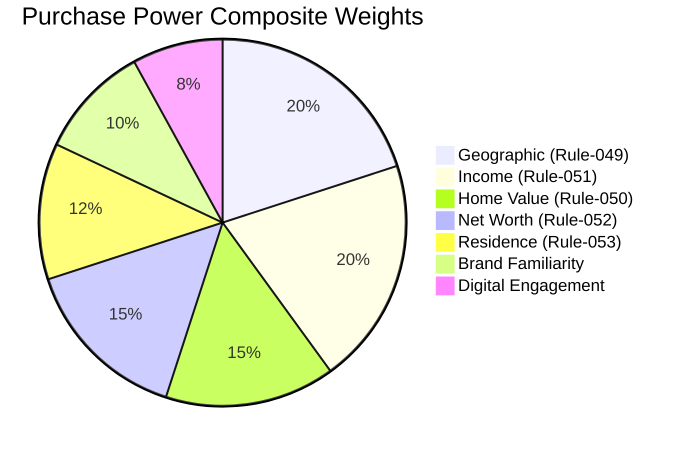
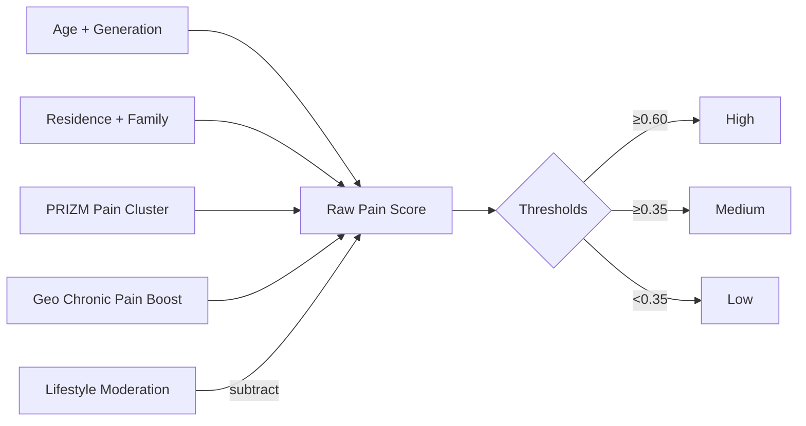
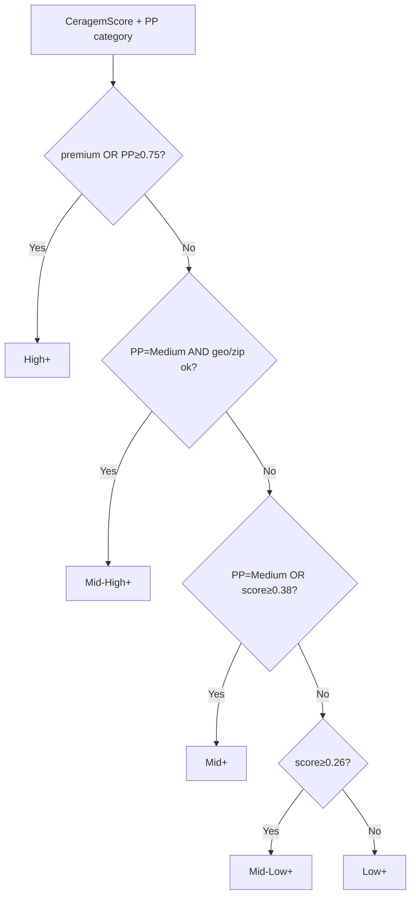
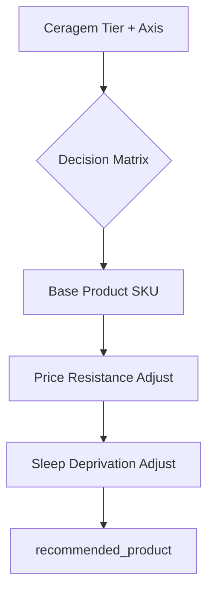

# Volume 30 — Intelligence Logic & Formulas Reference

**목적:** 현재 구현된 Intelligence의 **로직·수식·임계값**을 코드(`backend/app/intelligence/`, `backend/app/campaign/`)와 1:1로 대응시켜 설명합니다.  
**연관 문서:** [29 Intelligence Modeling Guide](./29_Intelligence_Modeling_Guide.md) (아키텍처·UI 매핑) · [04 Intelligence Engine](./04_Intelligence_Engine.md) · [19 Calculation Framework](./19_Intelligence_Calculation_Framework.md)

**데이터 기준:** PostgreSQL 실데이터 2,611,461명 · Commercial `2026.07`

---

## 목차

1. [전체 의존 관계](#1-전체-의존-관계)
2. [Purchase Power (구매력)](#2-purchase-power-구매력)
3. [Pain Index (통증 지수)](#3-pain-index-통증-지수)
4. [Lifestyle Index (라이프스타일)](#4-lifestyle-index-라이프스타일)
5. [PRIZM Proxy Segment](#5-prizm-proxy-segment)
6. [Ceragem Segment (5-tier)](#6-ceragem-segment-5-tier)
7. [Recommendation Engine](#7-recommendation-engine)
8. [Revenue Forecast & Promo Layers](#8-revenue-forecast--promo-layers)
9. [Calculation Framework v19](#9-calculation-framework-v19)
10. [Opportunity Score (집계)](#10-opportunity-score-집계)
11. [Geo · Digital · Brand (대시보드 축)](#11-geo--digital--brand-대시보드-축)
12. [수식·임계값 빠른 참조표](#12-수식임계값-빠른-참조표)

---

## 1. 전체 의존 관계

고객 1명의 Intelligence는 **고정 순서**로 계산됩니다. 앞 단계 출력이 뒤 단계 입력이 됩니다.



**Pipeline 진입점:** `backend/app/intelligence/pipeline.py` → `run_intelligence_pipeline()`

---

## 2. Purchase Power (구매력)

**파일:** `purchase_power_rules.py` · **규칙:** Rule-049 ~ Rule-054  
**출력:** `purchase_power_category` (High/Medium/Low) · `purchase_power_index` (0.25 / 0.55 / 0.85)

### 2.1 직관적 설명

> “이 고객이 Ceragem 제품 가격대를 감당할 **재정적 여력**이 어느 정도인가?”

Datalogix(순자산·소득·주택가치) + ZIP 소득 + Geo context + 브랜드/디지털 신호를 **가중 합산**합니다.

### 2.2 컴포넌트 가중치 (Rule-054)



**복합 점수 (0~1):**

\[
PP_{score} = 0.20 \cdot G + 0.20 \cdot I + 0.15 \cdot H + 0.15 \cdot N + 0.12 \cdot R + 0.10 \cdot B + 0.08 \cdot D
\]

| 기호 | Rule | 수식 |
|------|------|------|
| \(G\) | 049 | `min(1, 0.35·premium_zip + 0.25·[median_income≥0.6] + 0.4·geo_context)` |
| \(I\) | 051 | numeric: `min(1, income/150000)` · categorical: `income_signal_strength` |
| \(H\) | 050 | `min(1, home_value_numeric/1e6)` 또는 `home_value_strength` |
| \(N\) | 052 | `net_worth_strength` |
| \(R\) | 053 | `min(1, residential_stability + 0.1·[dwelling_present])` |
| \(B\) | — | `brand_familiarity_signal` |
| \(D\) | — | `digital_engagement` |

### 2.3 ZIP 소득 baseline 보정

Datalogix income이 없을 때 (`format=missing` 또는 ZIP baseline):

\[
PP_{score} \leftarrow 0.65 \cdot PP_{score} + 0.35 \cdot zip\_purchase\_potential
\]

ZIP tier = High 이고 income 있음:

\[
PP_{score} \leftarrow 0.85 \cdot PP_{score} + 0.15 \cdot zip\_purchase\_potential
\]

### 2.4 레벨 임계값

| 조건 | Level | Index (`LEVEL_TO_INDEX`) |
|------|-------|--------------------------|
| \(PP_{score} \geq 0.65\) | **High** | 0.85 |
| \(0.35 \leq PP_{score} < 0.65\) | **Medium** | 0.55 |
| \(PP_{score} < 0.35\) | **Low** | 0.25 |

---

## 3. Pain Index (통증 지수)

**파일:** `pain_index_rules.py` · **규칙:** Rule-055 ~ Rule-059  
**출력:** `pain_index_category` · `pain_index` (numeric proxy)

### 3.1 직관적 설명

> “치료·통증 관리 **니즈**가 높은가?” (Master V therapeutic fit의 핵심 입력)

단독 변수(나이만, 거주만)로는 High가 되지 않습니다. **복합 신호**가 필요합니다.

### 3.2 컴포넌트

| Rule | 기여 |
|------|------|
| 055 Age | `age_life_stage × 0.5` |
| 056 Generation | `generation_pain_tendency × 0.5` |
| 057 Residence | stability `<0.5`: `×0.2` · `≥0.5`: `min(0.35, ×0.3)` |
| 058 Lifestyle | **감산:** `min(0.4, lifestyle×0.25 + wellness×0.15)` |
| PRIZM Pain cluster | `+0.1` (Aging in Place, Caregiving, Simple Life) |
| Caregiving hint | `+0.05` |
| Geo boost | `+ pain_geo_boost` |

**복합 (Rule-059):**

\[
Pain_{raw} = Age + Gen + Res + min(0.2, family×0.15) + PRIZM_{bonus} + Geo_{boost} - Lifestyle_{moderation}
\]

\[
Pain_{score} = clamp(Pain_{raw},\ 0,\ 1)
\]

### 3.3 레벨 임계값

| \(Pain_{score}\) | Level |
|-----------------|-------|
| ≥ 0.60 | **High** |
| ≥ 0.35 | **Medium** |
| < 0.35 | **Low** |



---

## 4. Lifestyle Index (라이프스타일)

**파일:** `lifestyle_rules.py` · **규칙:** Rule-060 ~ Rule-064

### 4.1 직관적 설명

> “웰니스·디지털·가계 안정성 관점에서 **Pause M / wellness narrative**에 맞는가?”

### 4.2 복합 수식 (Rule-064)

\[
Life_{score} = W + D + R + H + 0.15 \cdot geo + \mathbb{1}_{wellness\_PRIZM} \cdot 0.10
\]

| 기호 | Rule | 수식 |
|------|------|------|
| \(W\) | 060 | wellness PRIZM + digital≥0.5 + stable household → `min(1, signals×0.25)` 또는 `signals×0.1` |
| \(D\) | 061 | `digital_engagement × 0.35` |
| \(R\) | 062 | `retail_familiarity × 0.25` |
| \(H\) | 063 | `min(1, residential×0.2 + family×0.15)` |

**Pain High 감쇠:**

\[
\text{if } Pain = High:\quad Life_{score} \leftarrow Life_{score} \times 0.85
\]

### 4.3 레벨 임계값

| \(Life_{score}\) | Level |
|-----------------|-------|
| ≥ 0.60 | **High** |
| ≥ 0.35 | **Medium** |
| < 0.35 | **Low** |

---

## 5. PRIZM Proxy Segment

**파일:** `prizm_rules.py` · **규칙:** Rule-025 ~ Rule-033

### 5.1 직관적 설명

> Nielsen PRIZM을 **Datalogix + ZIP proxy**로 근사한 lifestyle cluster 라벨.

각 segment rule은 **다중 supporting indicator** 필요 (단일 변수로 segment 확정 불가).

### 5.2 대표 segment 조건 (예시)

| Segment | 핵심 조건 (≥3 indicators 등) |
|---------|-------------------------------|
| **Established Elite** | geo≥0.65, premium ZIP, stability≥0.7, income≥90k, … |
| **Suburban Sophisticates** | stability≥0.7, family household, lifestyle signals |
| **Wellness Seekers** | wellness signals, digital engagement |
| **Aging in Place** | age/generation, pain tendency → Pain Index 연동 |
| **Caregiving Households** | family hints, multi-adult household |

**Ceragem / Pain / Lifestyle**에서 PRIZM cluster set:

- **Wellness PRIZM:** Established Elite, Suburban Sophisticates, Wellness Seekers, Booming with Confidence  
- **Pain PRIZM:** Aging in Place, Caregiving Households, Simple Life

---

## 6. Ceragem Segment (5-tier)

**파일:** `ceragem_rules.py`  
**출력 형식:** `{Tier} · {Axis}` 예: `Mid-High+ · Pain Index`

### 6.1 두 축 개념

```mermaid
quadrantChart
    title Ceragem Segment Axes
    x Low Purchase Power --> High Purchase Power
    y Wellness Axis --> Pain Index Axis
    quadrant-1 High+ · Wellness
    quadrant-2 High+ · Pain
    quadrant-3 Low+ · Wellness
    quadrant-4 Low+ · Pain
```

| 축 | 의미 | 결정 요인 |
|----|------|-----------|
| **Tier** (High+ … Low+) | 구매력 baseline | PP index + ZIP affluence |
| **Axis** (Wellness / Pain Index) | 제품 narrative | PRIZM + Pain vs Lifestyle |

### 6.2 Tier 점수 (resolve_ceragem_tier)

\[
CeragemScore = min\!\left(1,\ 0.72 \cdot PP_{index} + 0.16 \cdot ZIP_{potential} + 0.12 \cdot Geo\right) + bonus
\]

| bonus 조건 | 값 |
|------------|-----|
| premium ZIP | +0.05 |
| ZIP tier High | +0.04 |
| ZIP tier Mid | +0.02 |

**Tier 결정 트리:**



### 6.3 Axis 결정 (resolve_segment_axis)

```
IF prizm ∈ PAIN_PRIZM AND pain ≥ 0.4        → Pain Index
IF prizm ∈ WELLNESS_PRIZM AND lifestyle ≥ 0.35 AND pain < lifestyle → Wellness
IF pain ≥ lifestyle + 0.06                  → Pain Index
ELSE                                        → Wellness
```

---

## 7. Recommendation Engine

**파일:** `recommendation_rules.py` · **규칙:** Rule-065 ~ Rule-067

### 7.1 Product Recommendation (Rule-065)

**입력:** Ceragem tier + axis, PP, Pain, Lifestyle, ZIP tier, PRIZM

**로직 구조:** tier × axis × PP/pain/lifestyle **decision table** → price resistance 조정 → sleep geo 조정



**대표 매핑 (일부):**

| Tier | Axis | Pain | Lifestyle | → Product |
|------|------|------|-----------|-----------|
| High+ | Wellness | — | — | Master V9 |
| High+ | Pain | High | — | Master V7 |
| High+ | Pain | ≠ High | — | Master V6 |
| Mid+ | Wellness | — | High | Pause M6 |
| Mid+ | Pain | High | — | Master V6 |
| Low+ | Wellness | — | — | Pause S4 |
| Low+ | Pain | — | — | Master V4 |

**Price resistance:** `commercial/engine.py` → `adjust_product_for_price_resistance()`  
**Sleep geo:** `adjust_product_for_sleep_deprivation()` — sleep-deprived metro → Pause M series nudge (V therapeutic은 Pain High에서 preserve)

### 7.2 Campaign Priority (Rule-066)

\[
PriorityScore = PP_{map} + LS_{map} + Pain_{map} + min(0.2,\ email×0.2) + min(0.08,\ sleep×0.25)
\]

| PP | LS | Pain | 가중 |
|----|----|------|------|
| High | — | — | +0.35 |
| Medium | — | — | +0.22 |
| Low | — | — | +0.10 |
| — | High | — | +0.25 |
| — | Medium | — | +0.15 |
| — | Low | — | +0.08 |
| — | — | High | +0.20 |
| — | — | Medium | +0.12 |
| — | — | Low | +0.05 |

| \(PriorityScore\) | Priority |
|-------------------|----------|
| ≥ 0.65 | High |
| ≥ 0.35 | Medium |
| < 0.35 | Low |

### 7.3 Campaign Strategy (Rule-067)

`(Ceragem Tier, Pain Axis)` → Premium / Consultation / Wellness / Financing / Educational Campaign

---

## 8. Revenue Forecast & Promo Layers

**파일:** `forecasting.py` · `promo_forecast.py` · **규칙:** Rule-068 ~ Rule-070

### 8.1 Baseline Conversion

Ceragem tier → conservative base rate:

| Ceragem Tier | Base Rate |
|--------------|-----------|
| High+ → High | 0.75% |
| Mid-High+ → Mid-High | 0.50% |
| Mid+ → Mid | 0.35% |
| Mid-Low+ → Mid-Low | 0.25% |
| Low+ → Low | 0.075% |

**Intelligence multiplier:**

\[
M = 1 + 0.12·Pain + 0.10·PainGeo + 0.14·PP + 0.10·ZIP_{pot} + 0.10·Email + 0.08·Brand
\]

\[
BaselineConv = min\!\left(BaseRate \times M,\ BaseRate \times 2.2\right)
\]

### 8.2 Standing Promo Uplift

\[
PromoMult = Bias_{SKU} \times PPFactor(promo\_pct,\ PP_{index})
\]

\[
UpliftedConv = min(BaselineConv \times PromoMult,\ BaselineConv \times 2.2)
\]

\[
PromoUplift = UpliftedConv - BaselineConv
\]

### 8.3 Revenue & Incentive

| Rule | 수식 |
|------|------|
| **068 Orders** | \(Orders = TargetCustomers \times Conversion\) |
| **069 Revenue** | \(Revenue = Orders \times GrossSalesPrice\) |
| **070 Le Frame** | \(Incentive = Orders \times SKUCommission\) (15% of gross) |

**Effective customer payment (Commercial):**

\[
EffectivePrice = GrossSales \times (1 - PromoPct)\quad\text{(standing promo SKU)}
\]

\[
EffectivePrice = GrossSales\quad\text{(non-promo SKU)}
\]

---

## 9. Calculation Framework v19

**파일:** `calculation_framework.py`

모든 카테고리 score를 **0–100**으로 표준화:

\[
normalize(x) = clamp(x \times 100,\ 0,\ 100)\quad\text{if proxy } x \in [0,1]
\]

**Confidence (카테고리별):**

\[
Confidence = normalize\!\left((composite \times 70) + (data\_completeness \times 25) + level\_bonus\right)
\]

**Campaign Priority Grade:** A–D (`PRIORITY_TO_GRADE` mapping)

각 카테고리 envelope: `primary_factors`, `supporting_rules`, `business_rule_id`, `calculation_version`

---

## 10. Opportunity Score (집계)

**파일:** `opportunity_score.py` · Mission Control State/ZIP ranking

### 10.1 State Opportunity Score

**Intelligence blend (0–100 scale inputs):**

\[
Blend = 0.22·Pain + 0.20·PP + 0.18·Life + 0.20·Brand + 0.20·Digital
\]

\[
ConversionPts = min(99,\ conversion \times 10000)
\]

\[
RevenueShare = revenue / maxRevenue
\]

\[
ProductFit = min(18,\ SeriesFit + PriceAccessibility + LifestyleFit)
\]

**최종:**

\[
OppScore = clamp\!\Big(0.55·Blend + 0.25·(RevenueShare×85) + 0.15·ConversionPts + ProductFit,\ 8,\ 99\Big)
\]

### 10.2 Series Fit Bonus (ProductFit 일부)

| Product | 조건 | Bonus |
|---------|------|-------|
| Master V* | pain ≥ 38 | `min(10, (pain-33)×0.16)` |
| Pause M* | lifestyle ≥ 36 | `min(10, (life-31)×0.14)` |
| Pause S4 | pain < 42 | `min(10, (42-pain)×0.14)` |
| Pause S4 | lifestyle ≥ 40 | `min(10, life×0.08)` |

### 10.3 Price Accessibility Fit

`effective_customer_payment(outreach SKU)` vs PP score — tiered bonus/penalty (예: PP<38 & price≤4200 → +9.0)

### 10.4 ZIP Opportunity Score

\[
ZipScore = 0.24·PP + 0.18·Priority + 0.20·(RevShare×85) + 0.12·ConvPts + 0.5·SeriesFit + 0.26·IntelBlend
\]

### 10.5 Radar X-axis Spread (표시 전용)

cohort 내 X축 값이 촘촘할 때 시각 분산:

\[
X'_{i} = floor + \left(\frac{x_i - min}{max-min}\right)^{0.85} \times (ceiling - floor)
\]

기본: `floor=18`, `ceiling=92` — **Y축 Opportunity Score는 변경 없음**

---

## 11. Geo · Digital · Brand (대시보드 축)

State/ZIP rollup 집계 시 Mission Control radar/map에 사용:

| 축 | 소스 | 설명 |
|----|------|------|
| **Digital Score** | Datalogix online access + metro tier | email/digital 캠페인 적합 |
| **Brand Score** | Korean enclave %, state brand affinity | `geo/brand_familiarity_geo.py` |
| **Pain Geo** | State chronic pain reference | ZIP/state pain_index boost |
| **Lifestyle Geo** | Metro wellness tier | state lifestyle_score |

State performance는 `UploadRollup` + `mv_state_revenue` + geo enrichment로 aggregate.

---

## 12. 수식·임계값 빠른 참조표

### Index Level → Numeric (Dashboard rollup)

| Level | PP Index | Pain/Lifestyle proxy |
|-------|----------|----------------------|
| High | 0.85 | Pain High ≈ 0.75 |
| Medium | 0.55 | ≈ 0.50 |
| Low | 0.25 | — |

### Composite Threshold Pattern (PP / Pain / Lifestyle 공통)

| Score range | Label |
|-------------|-------|
| ≥ 0.60 | High |
| ≥ 0.35 | Medium |
| < 0.35 | Low |

*(PP는 composite ≥0.65 → High, ≥0.35 → Medium)*

### 구현 파일 인덱스

| Intelligence | Rules | Module |
|--------------|-------|--------|
| Purchase Power | 049–054 | `purchase_power_rules.py` |
| Pain Index | 055–059 | `pain_index_rules.py` |
| Lifestyle | 060–064 | `lifestyle_rules.py` |
| PRIZM Proxy | 025–033 | `prizm_rules.py` |
| Ceragem Segment | — | `ceragem_rules.py` |
| Recommendation | 065–067 | `recommendation_rules.py` |
| Forecast | 068–070 | `forecasting.py` |
| Promo Layers | — | `promo_forecast.py` |
| Framework v19 | — | `calculation_framework.py` |
| Opportunity Score | — | `opportunity_score.py` |
| Executive Aggregate | — | `executive_dashboard.py` |

---

## 부록: Mission Control 위젯 ↔ Intelligence 매핑

위젯 스크린샷 및 UI 데이터 dictionary는 [Volume 29 §8](./29_Intelligence_Modeling_Guide.md#8-mission-control--위젯별-데이터-사전) 참조.

| 위젯 | 사용 Intelligence |
|------|-------------------|
| Expected Revenue / Conversion | Forecast Rule 068–069, promo layers |
| Opportunity Radar Y | `compute_state_opportunity_score` |
| Opportunity Radar X | PP / Pain / Life / Brand / Digital (+ spread) |
| Ceragem Distribution | Ceragem tier rollup |
| ORION DNA | Framework category averages |
| Recent Opportunities | `compute_zip_opportunity_score` |
| Commercial Panel | Standing promo + `effective_customer_payment` |

---

*코드 변경 시 본 문서의 수식·임계값을 함께 업데이트하세요. 테스트: `test_opportunity_score.py`, `test_standing_promotions.py`, `test_executive_dashboard.py`*
